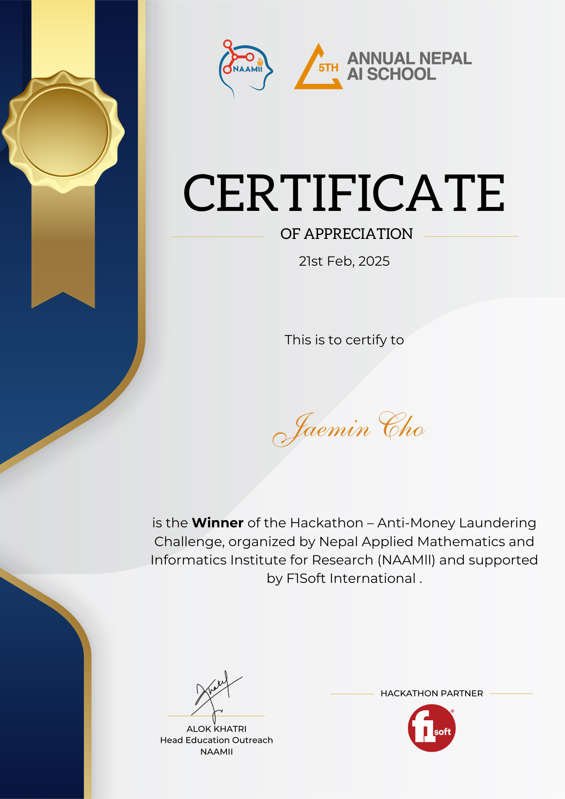

**Winner** of the *Hackathon - Anti-Money Laundering Challenge*, organized by the **Nepal Applied Mathematics and Informatics Institute for Research (NAAMII)**.  
Sponsored by **UK International Development**, **The Asia Foundation**, **Data for Development in Nepal**, **eSewa Ltd.**, and **Fonepay**, with additional support from **Google**, **SecurityPal**, and **Fusemachines**.

  

    
  

  

    
  

## Grants & Funding

